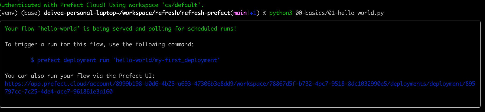

# refresh-prefect


## Prerequisite
```shell
python3 -m venv venv 
source venv/bin/activate

pip3 install -U prefect

pip3 list
```

## Environment: 
[Local setup](setup/local.md)
[Prefect-Cloud](setup/prefect-cloud.md)

## Prefect samples
[01 Hello world](01.md)


## Create a new deployment
[Create python program for workflow Flow](00-basics/01-hello-world.py)
```shell
python3 00-basics/01-hellow-world.py

```


